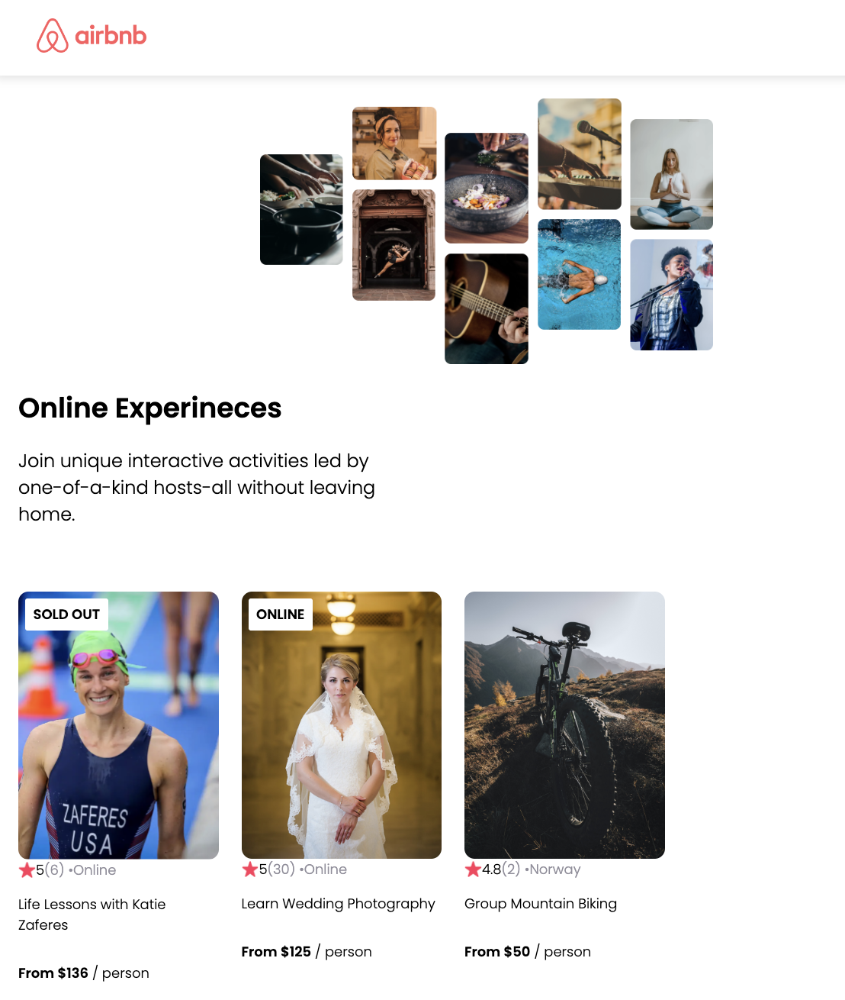

### Scrimba Learn React tutorial - Airbnb Experience

I was annoyed that I couldn't run the app locally as I followed along Scrima's [Intro to React tutorial](https://v2.scrimba.com/learn-react-c0e), so here's the code that I used to run the code locally. 


Tutorial 2: `Build an Airbnb Experinece clone` 



---

* `Step 1`: install node & NPM
* `Step 2`: create a vite project
* `Step 3`: run vite project locally, this allows you to view the changes in Chrome/Safari/your local browser 
* `Step 4 (Optional)`: build the app for deployment 

#### Step 2: create a new project with Vite
Create a vite project:
```
npm create vite@latest
```

#### Step 3: Run locally:
```
cd scrimba_airbnb_experiences #replace with local folder name
npm install
npm run dev
```

#### Step 4: build the app for deployment 

